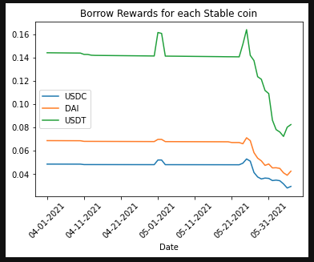
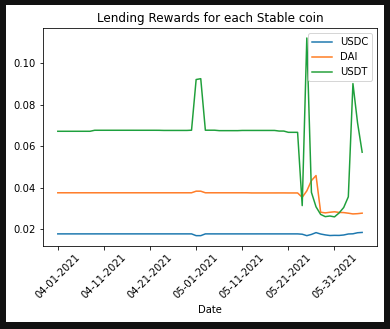
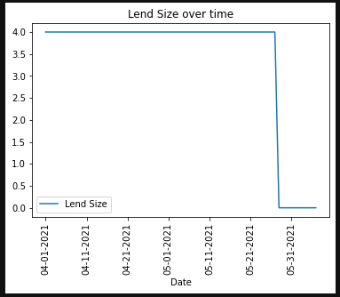
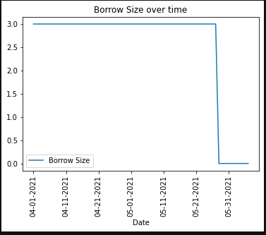

# Summarization of our findings

# Looking at each of the stable coins, which coin has the best return rate (without rewards) over time?
-- We wanted to get an idea for which coins gave the best returns without taking the price of MATIC into consideration
The stable coins with the best return rate was USDT. The advantage(s) USDT has is that the pool is smaller, which allows a quicker swing to higher 
yield, and cannot be used on the AAVE platform as collateral to borrow against.

# Which coin has the best rewards rate over time?
The coin with the best rewards rate over time was USDT. The reasons given in the prior question have heavily contributed to USDT receiving the
best rate.

# When is it appropriate to enter a leveraged vs unleveraged position? After the opportunity comes, what should that position be?
It is appropriate to enter a leveraged strategy when this position can outperform the best return from only earning yield from a stablecoin. Typically,
the standard to compare against a leveraged position is being in the USDT pool for the unleveraged strategy. The position for the leveraged strategy will be
to use DAI as a form of collateral to borrow USDC.

# How much were the return(s) gained on day? 
The average amount with the leveraged strategy was consistent with a return of .001005 and the returns for the unleveraged strategy can vary 
between .0001 and .0006.

# If we were to invest 10,000 dollars into the optimal deposit/return strategy, how much money would we aggregate in the given period? 
There would be a return of around 685 dollars, which means that the strategy had been able to gain a minimum amount above 300 dollars per month.